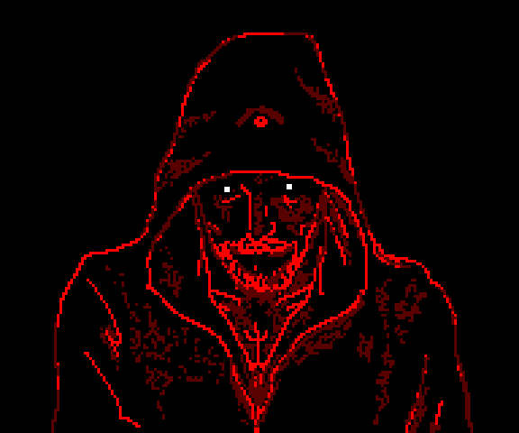

## Кодовая база /tg/station

TGstation - [https://github.com/tgstation/tgstation](https://github.com/tgstation/tgstation)

## АНДРОМЕДА-13

Этот форк был обработан темнейшим из преисподни говнокодеров.. Дальше бога нет.

Дальше только Rewokin и его код, что походит на говноруны...

Андромеда-13 - это комьюнити по 2D космонавтикам, что было сформировано 24.12.2022, было в пике и падении. Но основной пласт игроков по сей день держится вместе.

Space Station 13 — это адский симулятор космического хаоса с ролевой отыгровкой, где ты можешь быть клоуном, устроившим кровавый карнавал в отделе безопасности, предателем, подрывающим реактор под маской мирного инженера, или генетиком, случайно превратившим весь экипаж в ходячих бананов. Здесь двери ущемляют анробастов, провода убивают, в атмосферу выпускают плазму, а клоуна бьют за то, что он клоун. Админ то спавнит метеоритный дождь из бананов, то устраивает зомби-апокалипсис посреди смены. Это игра, где твой лучший друг может внезапно выстрелить тебе в спину, а капитан станции — оказаться клонированным шесть раз подряд. Здесь нет правил, есть только веселье, предательство и тонны крови на полу.

## Ссылки

[Дискорд](https://discord.gg/NxTZeUPtRf)

## Документация

- Для локализации на Русский язык, ознакомьтесь с [документацией](.github/guides/LOCALIZATION.md).
- Чтобы познать древние руны, нужна волшебная [книга](https://secure.byond.com/docs/ref/#/DM).

## Контрибьют (Помощь в разработке)

Мы рады принять вклад от любого человека. Заходите в Discord, если хотите помочь.
Только убедитесь, что ваши изменения и PRы/ПРы соответствуют простым пунктам.

1. Не говнокодить, используйте мозг
2. Провести тест, пожалейте Ревокина
3. Название и описание (фото/видио к ПРу по желанию)
4. Перед отправкой зайти обновить свой форк (Sync fork), если это не сделать, ожидайте спортиков у двери.
5. Если ваш ворк давно не обновлялся, то после (Sync fork) проведите тесты ещё раз. Ведь за это время могло что-то измениться и ваш красивый код, превратится в нерабочий кусок говна.

## Сборка

- Сборка через DreamMaker устарела и может вызывать ошибки, например, `'tgui.bundle.js': cannot find file`.
- **Как компилировать в VSCode и другие варианты сборки?** Изучите вот эту [документацию](tools/build/README.md).

## ЛИЦЕНЗИЯ

Весь код после [коммита 333c566b88108de218d882840e61928a9b759d8f от 31.12.2014, 16:38 PST](https://github.com/tgstation/tgstation/commit/333c566b88108de218d882840e61928a9b759d8f) распространяется под лицензией [GNU AGPL v3](https://www.gnu.org/licenses/agpl-3.0.html).

Весь код до [коммита 333c566b88108de218d882840e61928a9b759d8f от 31.12.2014, 16:38 PST](https://github.com/tgstation/tgstation/commit/333c566b88108de218d882840e61928a9b759d8f) распространяется под лицензией [GNU GPL v3](https://www.gnu.org/licenses/gpl-3.0.html). (Включая инструменты, если иное не указано в их файлах README.)

Подробности см. в файлах LICENSE и GPLv3.txt.

DMAPI для TGS распространяется как подпроект под лицензией MIT.

Текст лицензии MIT см. в подвале файла [code/\_\_DEFINES/tgs.dm](./code/__DEFINES/tgs.dm) и в [code/modules/tgs/LICENSE](./code/modules/tgs/LICENSE).

Все ресурсы, включая иконки и звуки, распространяются под лицензией [Creative Commons 3.0 BY-SA](https://creativecommons.org/licenses/by-sa/3.0/), если не указано иное.
